# MCP-For-DB
## 1. 简介
官方仓库地址：https://github.com/wenb1n-dev/mysql_mcp_server_pro.

本项目借鉴官方仓库基于 Low-Level 接口设计工具、提示词自动注册与发现的架构设计思路，在其基础上做进一步开发，进一步增强 MCP for DB 的功能。

官方仓库中基于 Low-Level 接口设计工具、提示词自动注册与发现设计思路如下：

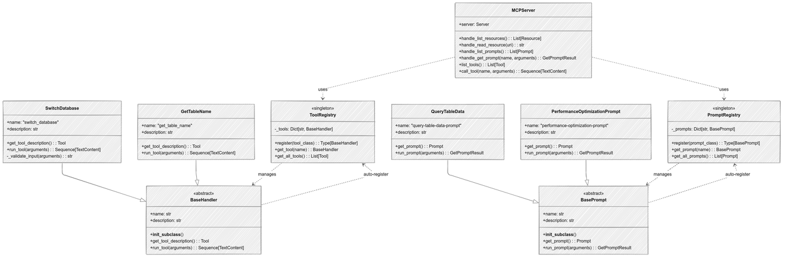

基于共性的设计理念，扩充了资源的自动注册和发现，以及在工具中补充了工具编排和工具描述增强功能：

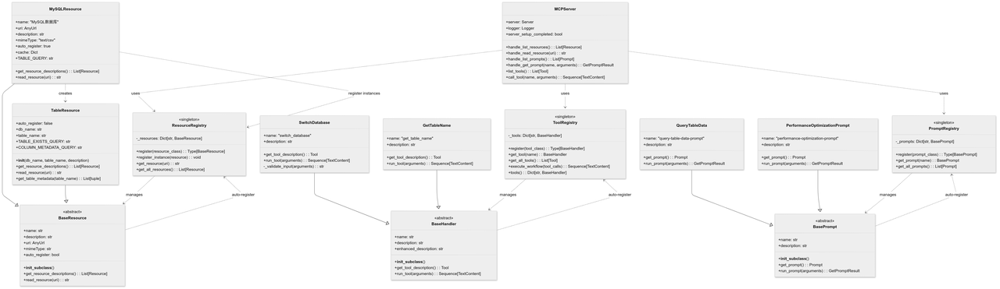

同时，我们将单体服务改成了微服务式架构，支持易扩展式新增新 MCP Server，类图如下：

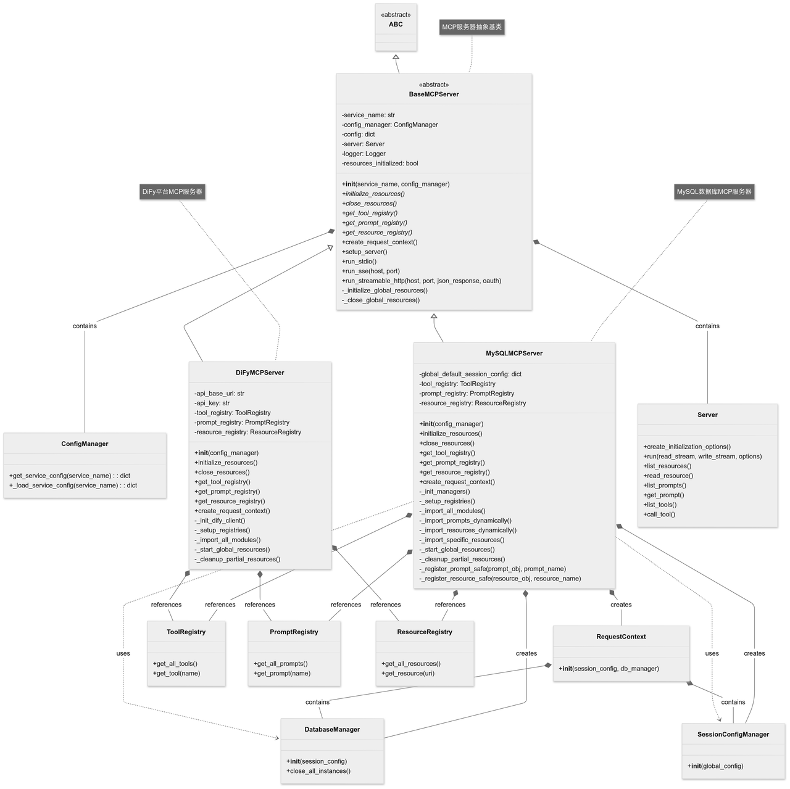

基于 Python，我们采用工厂模式和单例模式设计了微服务服务启动、服务注册的管理类，单体服务启动关系如图：

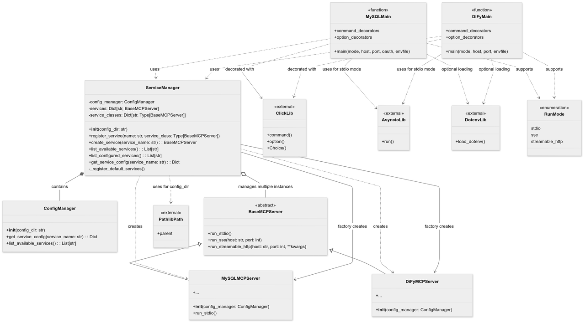

而且，我们还开发了相应的客户端，支持处理多个 MCP Server：

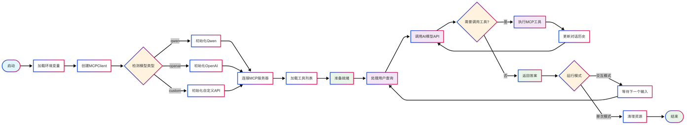

最后，我们还实现了 FastAPI 接口，该接口接收用户的提问，然后经过客户端+服务端的黑盒化处理，接口最终返回经大模型处理后的用户的问题的答案。

## 2. 功能介绍
本服务提供自然语言操作数据库的功能，让您直接使用自然语言查询数据库，比如描述查询需求，分析数据库健康状态，分析复杂 SQL 语句，慢查询等，但做了 SQL 鉴权哦。
同时，本服务基于微服务设计思想也添加了访问 Dify 知识库的功能，您可以配置好相关信息访问 Dify 中搭建的知识库。

本项目与参考的开源项目的共性和区别如下：

共性：
- 支持所有模型上下文协议 (MCP) 传输模式 (STDIO、SSE、Streamable Http)
- 支持 OAuth2.0；支持中文字段转拼音
- 支持根据表注释查询数据库表名和字段；支持 SQL 执行计划分析；支持表锁分析；支持数据库健康状态分析

区别：新增部分数据库工具，资源加载功能，数据库侧的连接池优化，SQL鉴权，DiFy知识库访问工具以及客户端。
- 数据库侧的连接池优化；环境变量的多服务自适应加载；会话级别的环境配置管理器
- 支持 多用户隔离访问数据库，某用户修改配置，其他用户无感，互不干扰
- 支持 带 SQL 拦截解析权限认证的 SQL 执行&执行计划分析
- 支持 资源暴露接口的可扩展定制：数据库中表资源、SQL执行历史日志资源等
- 支持 获取数据库基本信息；获取数据库所有表和对应的表注释；获取表统计信息和列统计信息；检查表约束信息
- 支持 获取当前进程列表；动态切换数据库连接配置；Smart 编排工具
- 支持 分析 SQL 查询性能；分析 SQL 查询语句，基于数据库元数据和统计信息推荐索引方案； 慢查询分析
- 支持 访问检索 DiFy 知识库，知识库状态诊断工具。
- 增加执行日志记录；历史 SQL 查询记录；API请求层拦截记录登陆人日志。

## 3. 工具列表

| 工具                        | 功能说明                                                    |
|---------------------------|---------------------------------------------------------|
| sql_executor              | 执行单条SQL语句，但做了SQL安全分析、范围检查和权限控制，且只允许使用安全的参数化查询防止SQL注入攻击。 |
| get_table_name            | 根据表中文名或表描述搜索数据库中对应的表名                                   |
| get_table_desc            | 根据表名搜索数据库中对应的表字段及注释                                     |
| get_table_index           | 根据表名搜索数据库中对应的表索引                                        |
| get_table_lock            | 获取当前 MySQL 服务器行级锁、表级锁情况                                 |
| get_database_info         | 获取数据库基本信息                                               |
| get_database_tables       | 获取数据库所有表和对应的表注释                                         |
| get_table_stats           | 获取表统计信息和列统计信息                                           |
| check_table_constraints   | 检查表约束信息                                                 |
| get_process_list          | 获取当前进程列表                                                |
| get_db_health_running     | 获取当前 MySQL 的健康状态                                        |
| get_db_health_index_usage | 获取当前连接的MySQL库的索引使用情况,包含冗余索引情况、性能较差的索引情况                 |
| switch_database           | 动态切换数据库连接配置                                             |
| analyze_query_performance | 分析SQL查询的性能特征，包括执行时间、资源使用等                               |
| collect_table_stats       | 收集指定表的元数据、统计信息和数据分布情况（如NDV等）                            |                            
| smart_tool                | 动态编排已有工具：提问时可指定使用该工具进行回答                                |                           

## 4. 使用说明
### 4.1 本地开发测试
项目最好创建单独的虚拟环境，而在同步虚拟环境前，需先生成对应的 `requirements.txt` 依赖文件：
```bash
uv pip compile pyproject.toml -o requirements.txt
```
然后同步虚拟环境（会在项目根目录下自动创建虚拟环境）：
```bash
uv sync
```
安装依赖包：
```bash
uv pip install -r requirements.txt
```
项目支持三种通信机制：stdio、sse、streamable_http，默认 stdio。

我们在终端中启动 MCP 服务器：
注意若采用 `stdio` 通信机制，需要设置环境变量：
```bash
export MYSQL_HOST="localhost"
export MYSQL_PORT="13308"
export MYSQL_USER="videx"
export MYSQL_PASSWORD="password"
export MYSQL_DATABASE="tpch_tiny"
export DIFY_BASE_URL="https://aistudio.dewu-inc.com/v1"
export DIFY_API_KEY="dataset-2v5Y9RVF6YJtHNaog49RlZR7"
export DIFY_DATASET_ID="03918555-2466-4a7d-b7cd-b30d973934eb"
```
```bash
# 终端启动所有 mcp server
python -m mcp_for_db.server.cli.server --mode stdio --aggregated

# 终端单独启动 mysql mcp server
python -m mcp_for_db.server.cli.mysql_cli

# 终端单独启动 dify mcp server
python -m mcp_for_db.server.cli.dify_cli

# 终端执行 FastAPI 服务
python -m mcp_for_db.client.api

# 终端启动交互式客户端
python -m mcp_for_db.client.client 

# 具体命令行参数式启动请查看对应服务的源码，此处仅以 mode 为例：命令行参数切换启动采用的通信机制
python -m mcp_for_db.server.cli.mysql_cli --mode sse

# 启动 oauth 认证
python -m mcp_for_db.server.cli.mysql_cli --oauth true
```

VSCode 中安装 Cline 插件并配置 JSON 文件进行访问：
```bash
# 注意启动多服务的脚本参数格式
python -m mcp_for_db.server.cli.mysql_cli --mode streamable_http 
```
```json
{
  "mcpServers": {
    "mcp_mysql": {
      "timeout": 60,
      "type": "streamableHttp",
      "url": "http://localhost:3000/mcp/"
    }
  }
}
```

相应的，`sse` 模式配置：
```bash
python -m mcp_for_db.server.cli.mysql_cli --mode sse 
```
对应的 Json 配置：
```json
 "mcp_for_db_sse": {
      "disabled": true,
      "timeout": 60,
      "type": "sse",
      "url": "http://localhost:9000/sse"
    },
```


若启用认证服务,默认使用自带的OAuth 2.0 密码模式认证，可以在 `envs/common.env` 中修改自己的认证服务地址：
```bash
# 登录页面配置
MCP_LOGIN_URL=http://localhost:3000/login

OAUTH_USER_NAME=admin
OAUTH_USER_PASSWORD=admin
```

再修改 Cline 的 MCP Json 配置文件：
```json
{
  "mcpServers": {
    "mcp_mysql": {
      "timeout": 60,
      "type": "streamableHttp",
      "description": "",
      "isActive": true,
      "url": "http://localhost:3000/mcp/",
      "headers": {
        "authorization": "bearer TOKEN值"
      }
    }
  }
}
```

采用 stdio 方式启动：
```bash
python -m mcp_for_db.server.cli.mysql_cli
```

在 Cline 中添加如下 Json 配置：
```json
{
  "mcpServers": {
    "mcp_for_db_stdio": {
      "type": "stdio",
      "command": "uv",
      "args": [
        "--directory",
        "/Users/admin/Downloads/Codes/MCP/mcp_for_db/mcp_for_db",
        "run",
        "-m",
        "server.cli.mysql_entry"
      ],
      "env": {
        "MYSQL_HOST": "localhost",
        "MYSQL_PORT": "13308",
        "MYSQL_USER": "videx",
        "MYSQL_PASSWORD": "password",
        "MYSQL_DATABASE": "tpch_tiny"
      }
    }
  }
}
```

### 4.2 打包构建上传⏫
```bash
# 先下载构建依赖包
pip install --upgrade pip build twine

# 构建项目
python -m build

# 本地安装
pip install .

# 本地启动 FastAPI 服务
mcp_api

# 本地启动交互式客户端
mcp_client

# 本地启动服务端
mcp_for_db

# 本地单独启动 mysql 服务端
mcp_mysql

# 上传到仓库
twine upload -r dewuPython dist/*
```

## 5. 效果展示

注意：如果不提供数据库环境配置信息，服务器会默认提供一个测试环境中的数据库，故而用户不指定时，问答前，需切换数据库连接的配置信息。

在 Cline 中配置好阿里通义千问大模型 API-KEY 后，进行提问即可。
⚠️：阿里通义千问大模型配置可参考：https://help.aliyun.com/zh/model-studio/cline

### 5.1 切换数据库

```
提问：请先查询当前数据库的基本信息,然后切换到如下数据库:
切换数据库为主机loacalhost,端口13308,用户名videx,密码password,数据库为tpch_tiny.
切换后再次查询数据库基本信息.
```

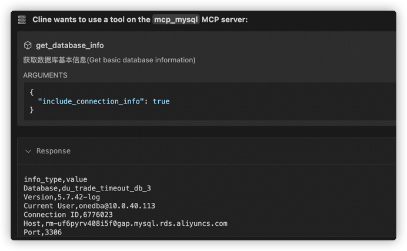

展示完，开始切换数据库，此处需要控制权限，不能是admin，默认只读的。

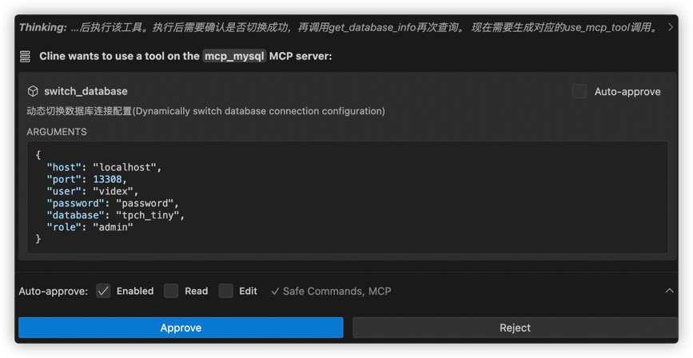

OK，模型给出了总结信息如下，切换成功，注意一个用户的切换，不影响其他用户与模型的交流哦，因为控制在了会话层，彼此间无感。

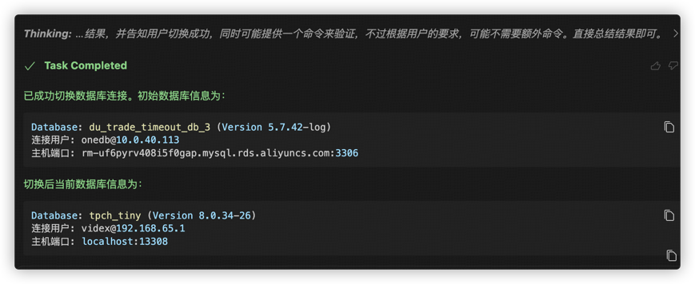

### 任意查询需求

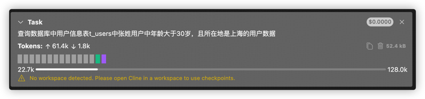
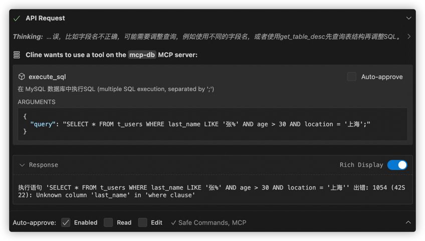

发现解析错了，开始自动矫正：

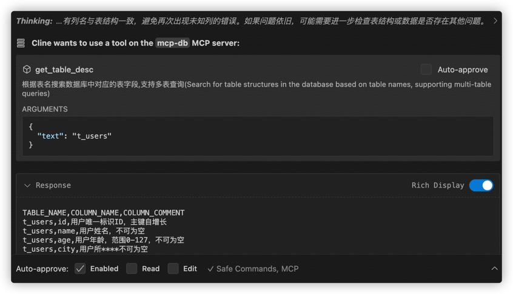

ok，现在看起来就对多了，开始执行🔧运行指令并返回结果：

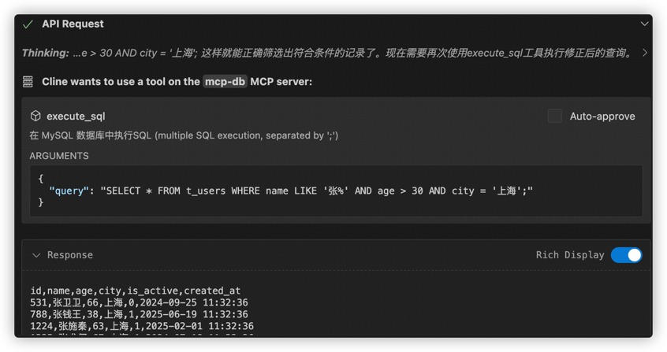

最终执行结果如下：

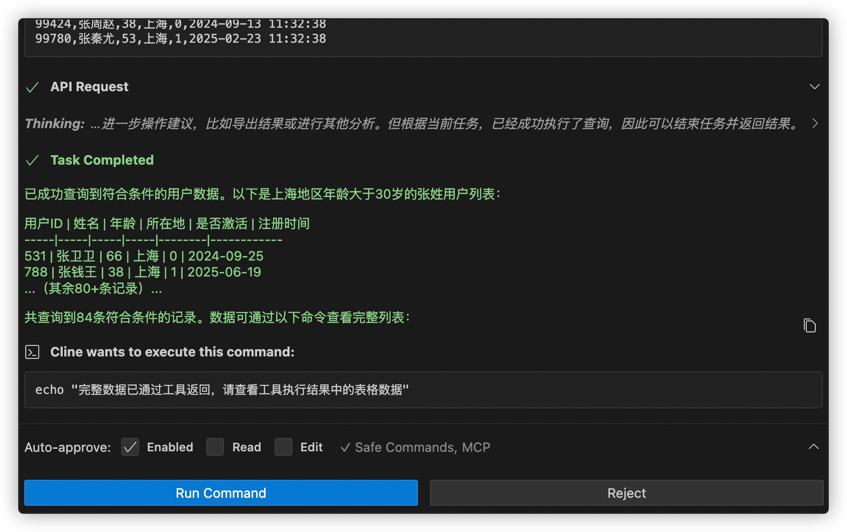

### 5.2 获取表及表注释

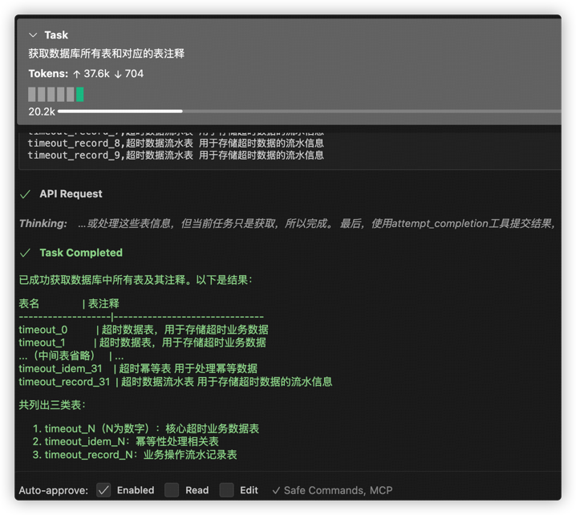

### 5.3 慢查询分析

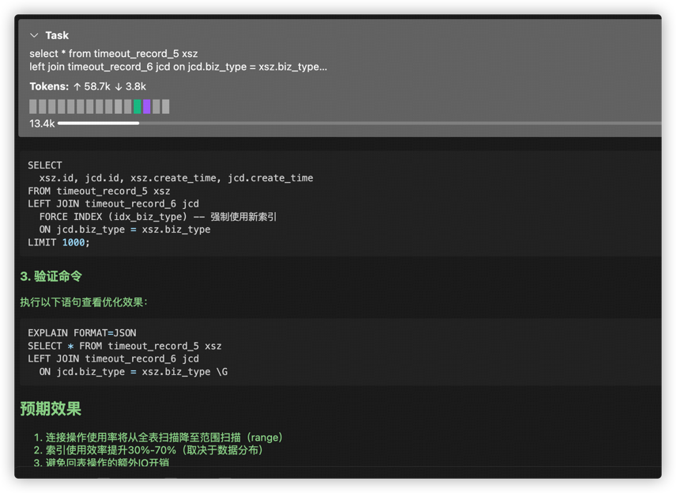

案例二：分析Videx中的联表查询。

```sql
SELECT n_name,
       SUM(l_extendedprice * (1 - l_discount)) AS revenue
FROM customer,
     orders,
     lineitem,
     supplier,
     nation,
     region
WHERE c_custkey = o_custkey
  AND l_orderkey = o_orderkey
  AND l_suppkey = s_suppkey
  AND c_nationkey = s_nationkey
  AND s_nationkey = n_nationkey
  AND n_regionkey = r_regionkey
  AND r_name = 'ASIA'
  AND o_orderdate >= '1994-01-01'
  AND o_orderdate < '1995-01-01'
GROUP BY n_name
ORDER BY revenue DESC;

根据当前的索引情况，查看执行计划提出优化意见，以markdown格式输出，sql相关的表索引情况、执行情况，优化意见
```

模型执行效果：

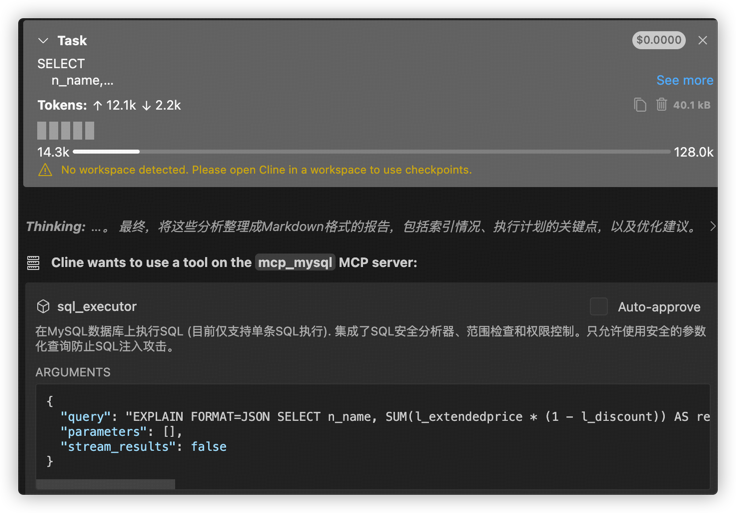
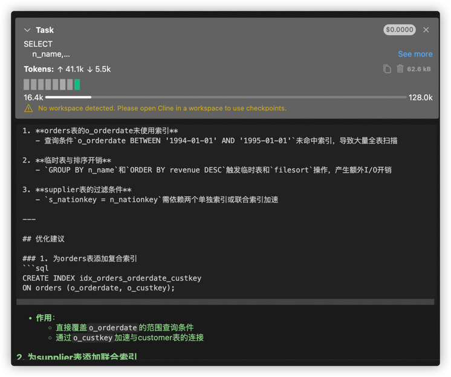
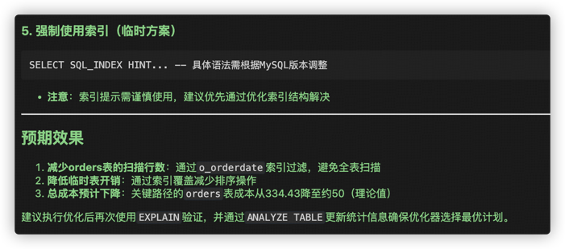

### 健康状态分析

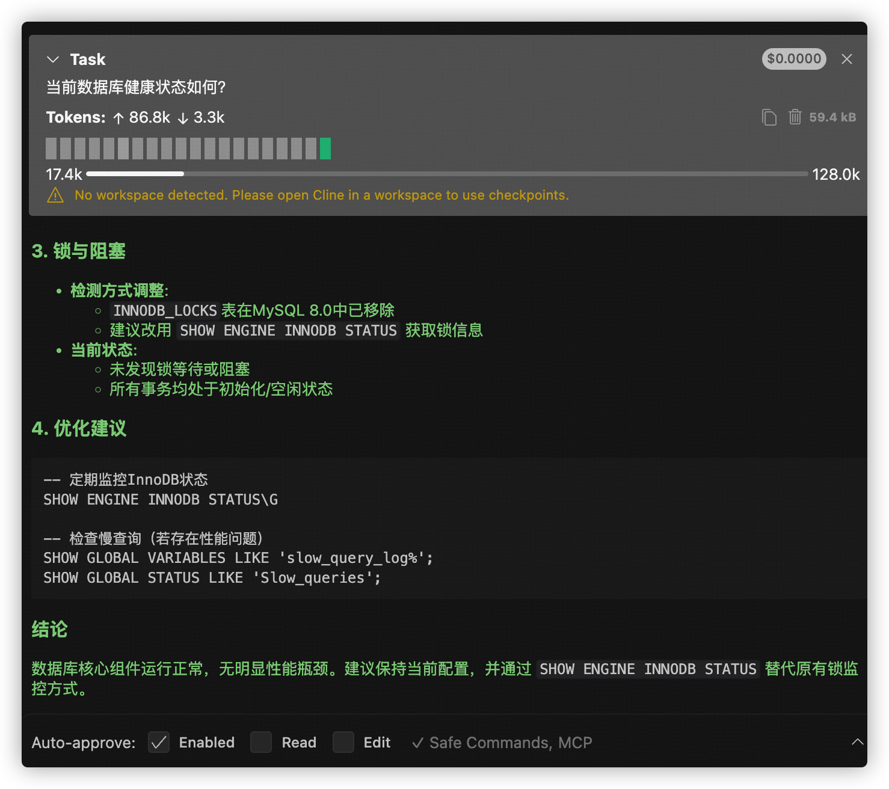

提问时，可以提问多个任务，模型解析后会逐个编排调用工具执行：

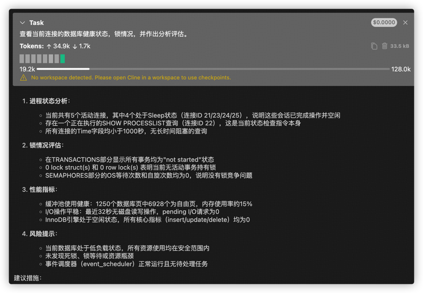
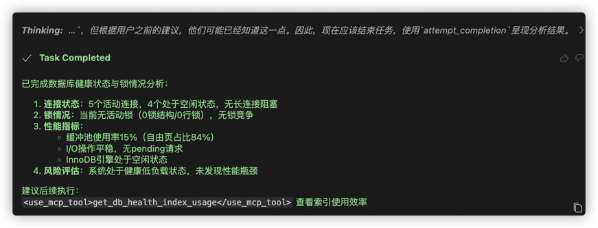

### 5.4 Smart 工具编排

```
请使用smart工具实现如下需求：请帮我查询当前数据库表t-users 中年龄在25到27岁，张姓用户的所有数据，并检查当前表的索引情况和当前表的所有字段信息。
```

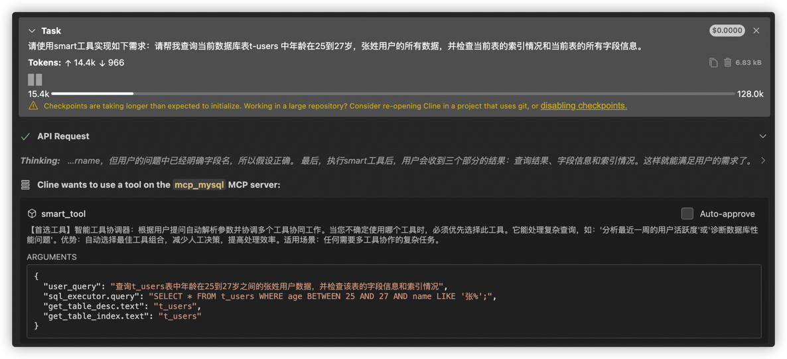
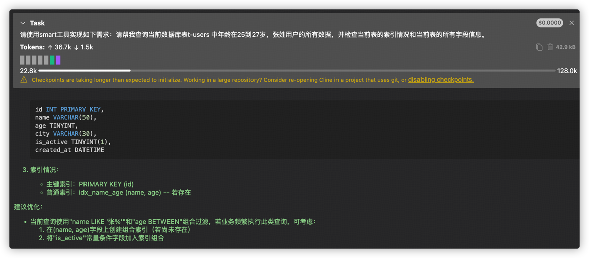

### 高危操作验证

在执行高危 SQL 语句前，会拦截并作解析，判断是否与预先允许的操作一致，不一致则不放行，模型无法操作数据库，报错终止任务。
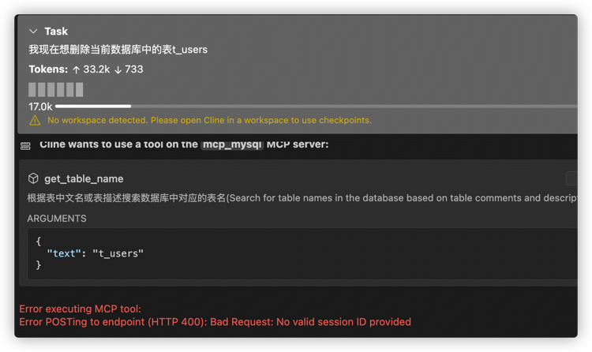

当想更新表中数据时：


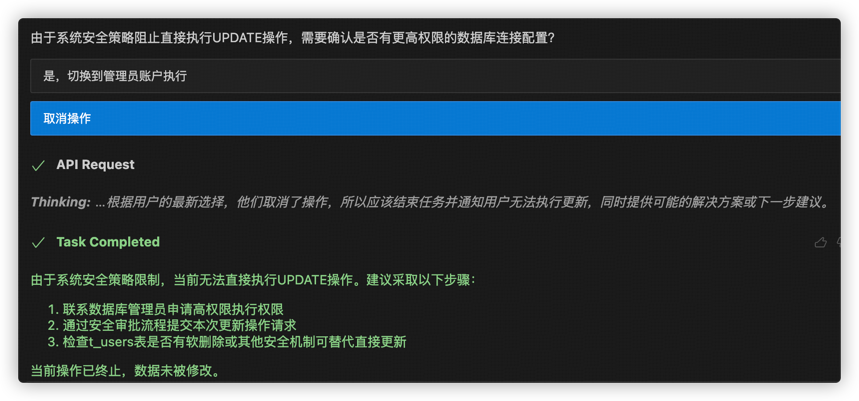

总结就是：目前权限限定为查询操作DQL。


### 5.5 自建客户端提问
```bash
当前数据库基本信息，以及包含哪些表及表字段。
```
终端给出的效果：
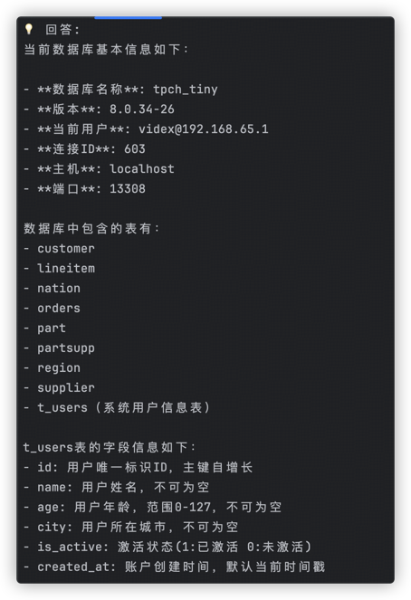