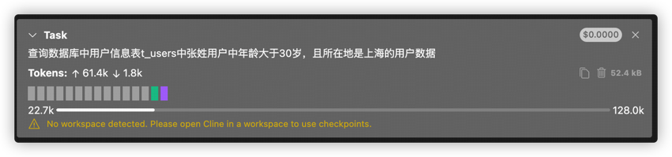
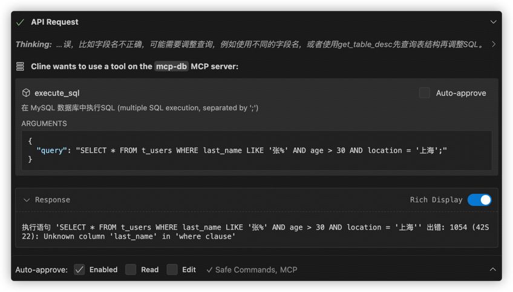
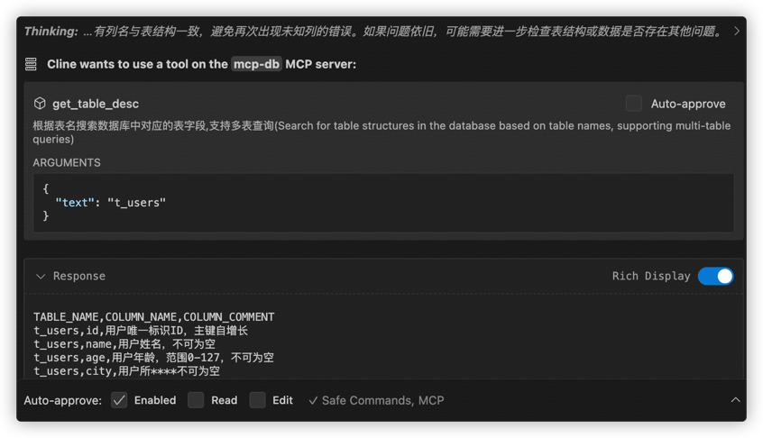
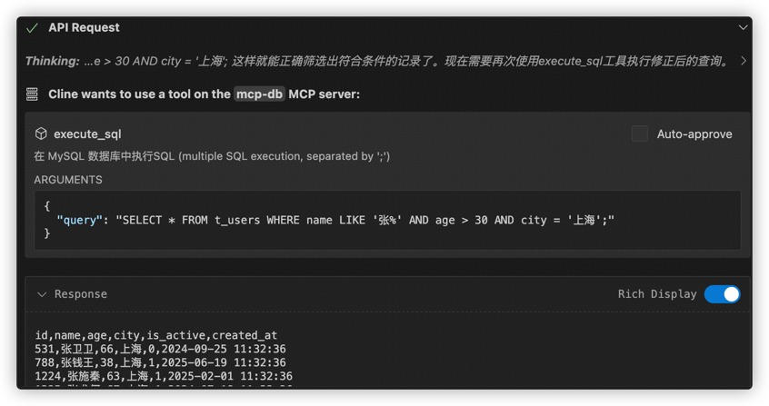
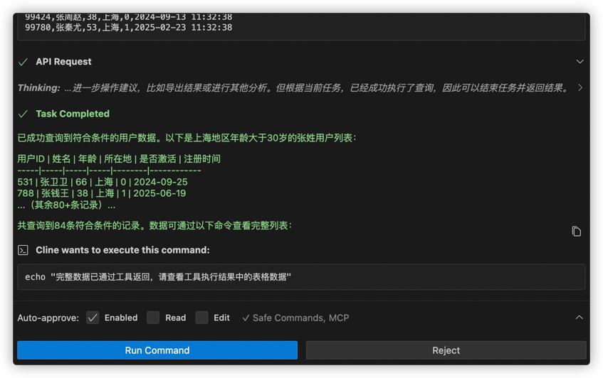

# MCP-For-DB
官方仓库地址：https://github.com/wenb1n-dev/mysql_mcp_server_pro.
本项目在官方仓库基础上做进一步开发，进一步增强 MCP for Mysql & DB 的功能。

## 介绍
项目目前具备的功能如下：

- 支持 MCP 所有传输模式（STDIO、SSE、Streamable Http）
- 支持 Oauth2 认证
- 支持 多 SQL 执行，以";"分隔
- 支持 根据表注释查询对应的数据库表名，表字段
- 支持 SQL执行计划分析
- 支持 中文字段转拼音
- 支持 锁表分析
- 支持 运行健康状态分析
- 支持 权限控制，只读（readonly）、管理员（admin）
- 支持 prompt 模版调用

## 工具列表
| 工具名称                  | 描述                                                                                                                                 |
|-----------------------|------------------------------------------------------------------------------------------------------------------------------------| 
| execute_sql           | sql执行工具，根据权限配置可执行["SELECT", "SHOW", "DESCRIBE", "EXPLAIN", "INSERT", "UPDATE", "DELETE", "CREATE", "ALTER", "DROP", "TRUNCATE"] 命令 |
| get_chinese_initials  | 将中文字段名转换为拼音首字母字段                                                                                                                   |
| get_db_health_running | 分析mysql的健康状态（连接情况、事务情况、运行情况、锁情况检测）                                                                                                 |
| get_table_desc        | 根据表名搜索数据库中对应的表结构,支持多表查询                                                                                                            |
| get_table_index       | 根据表名搜索数据库中对应的表索引,支持多表查询                                                                                                            |
| get_table_lock        | 查询当前mysql服务器是否存在行级锁、表级锁情况                                                                                                          |
| get_table_name        | 根据表注释、表描述搜索数据库中对应的表名                                                                                                               |
| get_db_health_index_usage | 获取当前连接的mysql库的索引使用情况,包含冗余索引情况、性能较差的索引情况、未使用索引且查询时间大于30秒top5情况                                                                      |
| use_prompt_queryTableData | 使用内置提示词，让模型构建一个链式调用mcp中的工具(不作为常用固定工具，需自行调整代码开启，详见该类)                                                                               |

## prompt 列表
| prompt名称                   | 描述                                                                                                                                 |
|----------------------------|------------------------------------------------------------------------------------------------------------------------------------| 
| analyzing-mysql-prompt     | 这是分析mysql相关问题的提示词       |
| query-table-data-prompt    | 这是通过调用工具查询表数据的提示词，描述可以为空，空时则会初始化为mysql数据库数据查询助手  |

## 使用说明
配置环境变量： 创建一个 `.env` 文件，内容如下：
```bash
# MySQL数据库配置
MYSQL_HOST=localhost
MYSQL_PORT=3306
MYSQL_USER=your_username
MYSQL_PASSWORD=your_password
MYSQL_DATABASE=your_database
# 可选值: readonly, writer, admin，默认为 readonly
MYSQL_ROLE=readonly
```

项目支持三种通信机制：stdio、sse、streamable_http，默认 streamable_http.

终端采用 uv 运行起服务器：
Docker方式启动的话，需先生成 requirements.txt 依赖：

```bash
uv pip compile pyproject.toml -o requirements.txt
```

安装依赖包：

```bash
uv pip install -r requirements.txt
```

终端启动MCP服务器：

```bash
uv run -m server.mcp.server_mysql

# 自定义env文件位置
uv run -m mysql_mcp_server_pro.server --mode sse --envfile /path/to/.env


# 启动oauth认证
uv run -m mysql_mcp_server_pro.server --oauth true
```

VSCode 中安装 Cline 插件并配置 JSON 文件：
```json
{
  "mcpServers": {
    "mcp_mysql": {
      "timeout": 60,
      "type": "streamableHttp",
      "url": "http://localhost:3000/mcp/"
    }
  }
}
```
若启用认证服务,默认使用自带的OAuth 2.0 密码模式认证，可以在 env 中修改自己的认证服务地址
```bash
# 登录页面配置
MCP_LOGIN_URL=http://localhost:3000/login

OAUTH_USER_NAME=admin
OAUTH_USER_PASSWORD=admin

```
再修改Cline的MCP Json配置文件：
```json
{
  "mcpServers": {
    "mcp_mysql": {
      "timeout": 60,
      "type": "streamableHttp",
      "description": "",
      "isActive": true,
      "url": "http://localhost:3000/mcp/",
      "headers": {
        "authorization": "bearer TOKEN值"
      }
    }
  }
}
```


## 效果展示

在 Cline 中配置好阿里通义千问大模型API-KEY后，进行提问：

⚠️：阿里通义千问大模型配置可参考：https://help.aliyun.com/zh/model-studio/cline

随后，大模型开始解析执行任务：

发现解析错了，开始自动矫正：

ok，现在看起来就对多了，开始执行🔧运行指令并返回结果：

最终执行结果如下：

