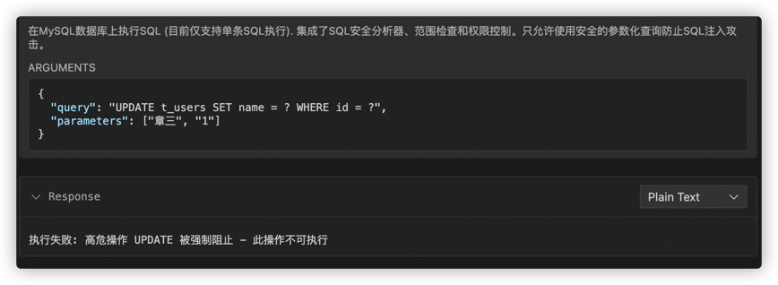

# MCP-For-DB

官方仓库地址：https://github.com/wenb1n-dev/mysql_mcp_server_pro.

本项目在官方仓库基础上做进一步开发，进一步增强 MCP for Mysql & DB 的功能。

## 介绍

本服务提供自然语言操作数据库的功能，让您直接使用自然语言实现对数据库操作的需求，比如描述查询需求，分析数据库健康状态，分析复杂SQL语句，慢查询等，但是做了鉴权哦，没有权限是会执行失败的。
同时，本服务允许多用户隔离的操作想要操作的数据库并提供切换数据库连接的工具哦。

具体的，项目在原先具备的功能上添加了如下功能：

- 数据库侧的连接池优化；环境变量的多服务自适应加载；会话级别的环境配置管理器
- 支持 多用户隔离访问数据库，某用户修改配置，其他用户无感，互不干扰
- 支持 带 SQL 拦截解析权限认证的 SQL 执行&执行计划分析
- 支持 资源暴露接口的可扩展定制：数据库中表资源、SQL执行历史日志资源等
- 支持 获取数据库基本信息；获取数据库所有表和对应的表注释；获取表统计信息和列统计信息；检查表约束信息
- 支持 获取当前进程列表；动态切换数据库连接配置；Smart 编排工具
- 支持 分析 SQL 查询性能；分析 SQL 查询语句，基于数据库元数据和统计信息推荐索引方案； 慢查询分析
- 支持 访问检索 DiFy 知识库，知识库状态诊断工具。

## 工具列表

| 工具                        | 功能说明                                                    |
|---------------------------|---------------------------------------------------------|
| sql_executor              | 执行单条SQL语句，但做了SQL安全分析、范围检查和权限控制，且只允许使用安全的参数化查询防止SQL注入攻击。 |
| get_table_name            | 根据表中文名或表描述搜索数据库中对应的表名                                   |
| get_table_desc            | 根据表名搜索数据库中对应的表字段及注释                                     |
| get_table_index           | 根据表名搜索数据库中对应的表索引                                        |
| get_table_lock            | 获取当前 MySQL 服务器行级锁、表级锁情况                                 |
| get_database_info         | 获取数据库基本信息                                               |
| get_database_tables       | 获取数据库所有表和对应的表注释                                         |
| get_table_stats           | 获取表统计信息和列统计信息                                           |
| check_table_constraints   | 检查表约束信息                                                 |
| get_process_list          | 获取当前进程列表                                                |
| get_db_health_running     | 获取当前 MySQL 的健康状态                                        |
| get_db_health_index_usage | 获取当前连接的MySQL库的索引使用情况,包含冗余索引情况、性能较差的索引情况                 |
| switch_database           | 动态切换数据库连接配置                                             |
| analyze_query_performance | 分析SQL查询的性能特征，包括执行时间、资源使用等                               |
| collect_table_stats       | 收集指定表的元数据、统计信息和数据分布情况（如NDV等）                            |                            
| smart_tool                | 动态编排已有工具：提问时可指定使用该工具进行回答                                |                           

## 使用说明

打包构建：

```bash
# 先下载依赖包
pip install --upgrade pip setuptools wheel build twine
# 已经 git 到本地打开了终端
# 构建项目
python -m build
# 本地安装
pip install .
# 本地启动
src

# 上传到仓库
twine upload -r dewuPython dist/*
```

配置环境变量： 创建一个 `.env` 文件，内容如下：

```bash
# MySQL数据库配置
MYSQL_HOST=localhost
MYSQL_PORT=3306
MYSQL_USER=your_username
MYSQL_PASSWORD=your_password
MYSQL_DATABASE=your_database
```

项目支持三种通信机制：stdio、sse、streamable_http，默认 streamable_http.
终端采用 uv 运行起服务器：
Docker方式启动的话，需先生成 requirements.txt 依赖：

```bash
uv pip compile pyproject.toml -o requirements.txt
```

安装依赖包：

```bash
uv pip install -r requirements.txt
```

终端启动MCP服务器：

```bash
uv run -m server.mcp.server_mysql

# 自定义env文件位置
uv run -m server.mcp.server_mysql --mode sse --envfile /path/to/.env

# 启动oauth认证
uv run -m server.mcp.server_mysql --oauth true
```

VSCode 中安装 Cline 插件并配置 JSON 文件：

```json
{
  "mcpServers": {
    "mcp_mysql": {
      "timeout": 60,
      "type": "streamableHttp",
      "url": "http://localhost:3000/mcp/"
    }
  }
}
```

若启用认证服务,默认使用自带的OAuth 2.0 密码模式认证，可以在 env 中修改自己的认证服务地址

```bash
# 登录页面配置
MCP_LOGIN_URL=http://localhost:3000/login

OAUTH_USER_NAME=admin
OAUTH_USER_PASSWORD=admin
```

再修改Cline的MCP Json配置文件：

```json
{
  "mcpServers": {
    "mcp_mysql": {
      "timeout": 60,
      "type": "streamableHttp",
      "description": "",
      "isActive": true,
      "url": "http://localhost:3000/mcp/",
      "headers": {
        "authorization": "bearer TOKEN值"
      }
    }
  }
}
```

采用 stdio方式启动：

```bash
uv run -m mysql_mcp_server_pro.server --mode sse 
```

在Cline中添加如下json配置：

```json
{
  "mcpServers": {
    "mcp_for_db": {
      "timeout": 60,
      "type": "stdio",
      "command": "uv",
      "args": [
        "run",
        "-m",
        "server.mcp.server_mysql",
        "--mode",
        "stdio"
      ],
      "env": {
        "MYSQL_HOST": "localhost",
        "MYSQL_PORT": "3306",
        "MYSQL_USER": "root",
        "MYSQL_PASSWORD": "password",
        "MYSQL_DATABASE": "mcp_db",
        "MYSQL_ROLE": "admin",
        "PYTHON": "/Users/admin/Downloads/Codes/MCP/MCP-DB/"
      },
      "disabled": true
    }
  }
}
```

## 效果展示

注意：如果不提供数据库环境配置信息，服务器会默认提供一个测试环境中的数据库，故而用户不指定时，问答前，需切换数据库连接的配置信息。

在 Cline 中配置好阿里通义千问大模型 API-KEY 后，进行提问即可。
⚠️：阿里通义千问大模型配置可参考：https://help.aliyun.com/zh/model-studio/cline

### 切换数据库

```
提问：请先查询当前数据库的基本信息,然后切换到如下数据库:
切换数据库为主机loacalhost,端口13308,用户名videx,密码password,数据库为tpch_tiny.
切换后再次查询数据库基本信息.
```


展示完，开始切换数据库，此处需要控制权限，不能是admin，默认只读的。


OK，模型给出了总结信息如下，切换成功，注意一个用户的切换，不影响其他用户与模型的交流哦，因为控制在了会话层，彼此间无感。


### 任意查询需求


发现解析错了，开始自动矫正：


ok，现在看起来就对多了，开始执行🔧运行指令并返回结果：


最终执行结果如下：


### 获取表及表注释


### 慢查询分析


案例二：分析Videx中的联表查询。

```sql
SELECT n_name,
       SUM(l_extendedprice * (1 - l_discount)) AS revenue
FROM customer,
     orders,
     lineitem,
     supplier,
     nation,
     region
WHERE c_custkey = o_custkey
  AND l_orderkey = o_orderkey
  AND l_suppkey = s_suppkey
  AND c_nationkey = s_nationkey
  AND s_nationkey = n_nationkey
  AND n_regionkey = r_regionkey
  AND r_name = 'ASIA'
  AND o_orderdate >= '1994-01-01'
  AND o_orderdate < '1995-01-01'
GROUP BY n_name
ORDER BY revenue DESC;

根据当前的索引情况，查看执行计划提出优化意见，以markdown格式输出，sql相关的表索引情况、执行情况，优化意见
```

模型执行效果：


### 健康状态分析


提问时，可以提问多个任务，模型解析后会逐个编排调用工具执行：


### Smart 工具编排

```
请使用smart工具实现如下需求：请帮我查询当前数据库表t-users 中年龄在25到27岁，张姓用户的所有数据，并检查当前表的索引情况和当前表的所有字段信息。
```


### 高危操作验证

在执行高危 SQL 语句前，会拦截并作解析，判断是否与预先允许的操作一致，不一致则不放行，模型无法操作数据库，报错终止任务。


当想更新表中数据时：




总结就是：目前权限限定为查询操作DQL。