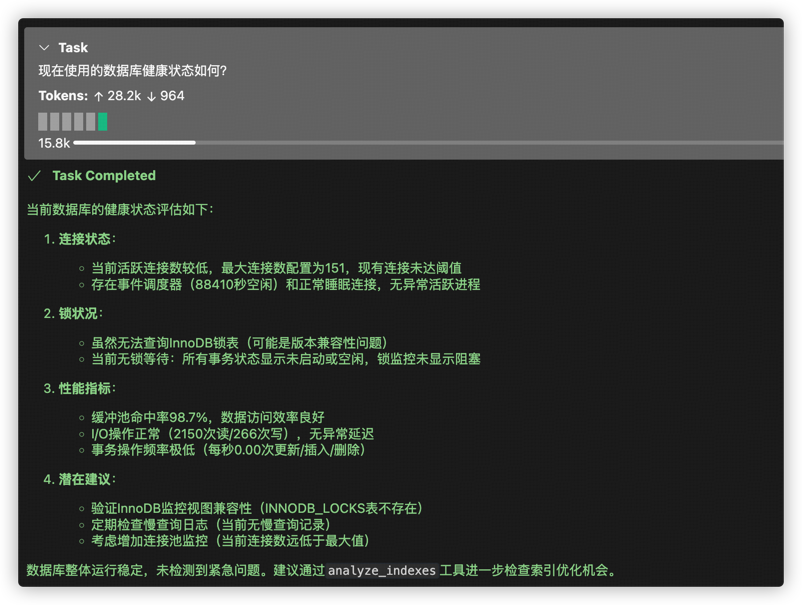

# MCP-For-DB

官方仓库地址：https://github.com/wenb1n-dev/mysql_mcp_server_pro.
本项目在官方仓库基础上做进一步开发，进一步增强 MCP for Mysql & DB 的功能。

## 介绍

项目目前具备的功能如下：

- 支持 MCP 所有传输模式（STDIO、SSE、Streamable Http）
- 支持 Oauth2 认证
- 支持 根据表注释查询对应的数据库表名，表字段
- 支持 中文字段转拼音
- 支持 锁表分析
- 支持 运行健康状态分析
- 支持 权限控制，只读（readonly）、管理员（admin）
- 支持 prompt 模版调用

新增功能：

- 数据库侧的连接池优化
- 支持 带SQL拦截解析权限认证的 SQL 执行 & 执行计划分析
- 支持 资源暴露接口的可扩展定制
- 支持 获取数据库基本信息
- 支持 获取数据库所有表和对应的表注释
- 支持 分析表统计信息和列统计信息
- 支持 检查表约束信息
- 支持 获取表的创建语句
- 支持 获取当前进程列表
- 支持 动态切换数据库连接配置
- 支持 分析SQL查询的性能特征，包括执行时间、资源使用等
- 支持 分析SQL查询语句，基于数据库元数据和统计信息推荐最佳索引方案
- 支持 慢查询分析

## 工具列表


## 使用说明

配置环境变量： 创建一个 `.env` 文件，内容如下：

```bash
# MySQL数据库配置
MYSQL_HOST=localhost
MYSQL_PORT=3306
MYSQL_USER=your_username
MYSQL_PASSWORD=your_password
MYSQL_DATABASE=your_database
# 可选值: readonly, writer, admin，默认为 readonly
MYSQL_ROLE=readonly
```

项目支持三种通信机制：stdio、sse、streamable_http，默认 streamable_http.

终端采用 uv 运行起服务器：
Docker方式启动的话，需先生成 requirements.txt 依赖：

```bash
uv pip compile pyproject.toml -o requirements.txt
```

安装依赖包：

```bash
uv pip install -r requirements.txt
```

终端启动MCP服务器：

```bash
uv run -m server.mcp.server_mysql

# 自定义env文件位置
uv run -m mysql_mcp_server_pro.server --mode sse --envfile /path/to/.env


# 启动oauth认证
uv run -m mysql_mcp_server_pro.server --oauth true
```

VSCode 中安装 Cline 插件并配置 JSON 文件：

```json
{
  "mcpServers": {
    "mcp_mysql": {
      "timeout": 60,
      "type": "streamableHttp",
      "url": "http://localhost:3000/mcp/"
    }
  }
}
```

若启用认证服务,默认使用自带的OAuth 2.0 密码模式认证，可以在 env 中修改自己的认证服务地址

```bash
# 登录页面配置
MCP_LOGIN_URL=http://localhost:3000/login

OAUTH_USER_NAME=admin
OAUTH_USER_PASSWORD=admin

```

再修改Cline的MCP Json配置文件：

```json
{
  "mcpServers": {
    "mcp_mysql": {
      "timeout": 60,
      "type": "streamableHttp",
      "description": "",
      "isActive": true,
      "url": "http://localhost:3000/mcp/",
      "headers": {
        "authorization": "bearer TOKEN值"
      }
    }
  }
}
```

## 效果展示
在 Cline 中配置好阿里通义千问大模型API-KEY后，进行提问：

⚠️：阿里通义千问大模型配置可参考：https://help.aliyun.com/zh/model-studio/cline

随后，大模型开始解析执行任务：

发现解析错了，开始自动矫正：

ok，现在看起来就对多了，开始执行🔧运行指令并返回结果：

最终执行结果如下：


### 获取表及表注释


### 慢查询分析


### 健康状态分析
