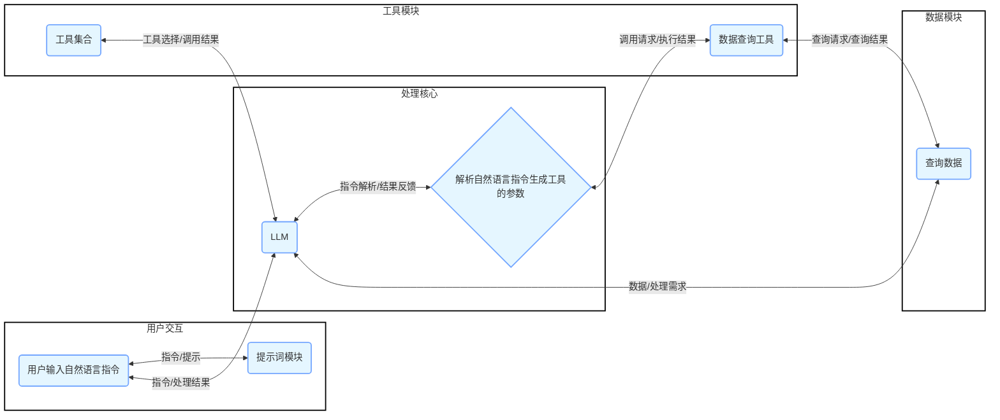
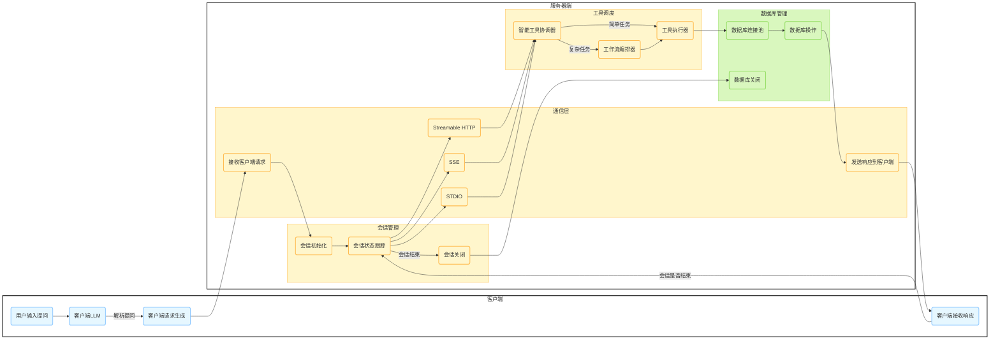
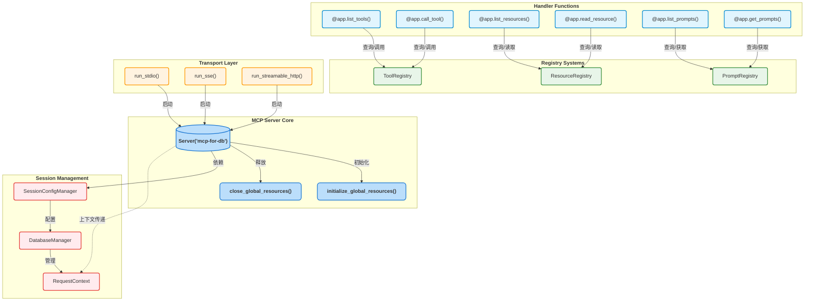
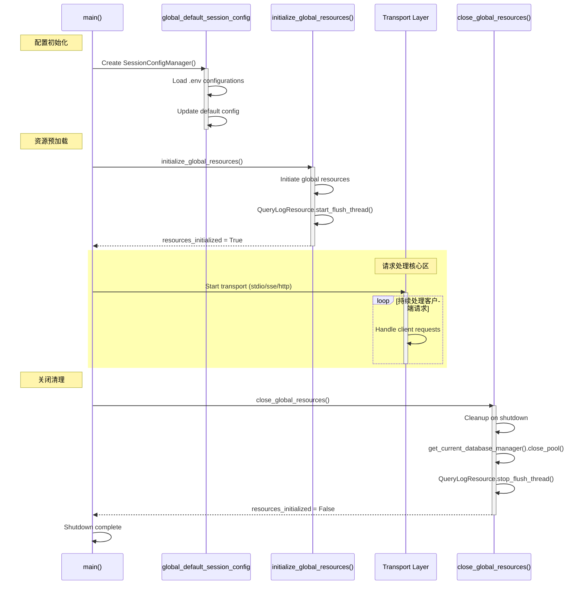
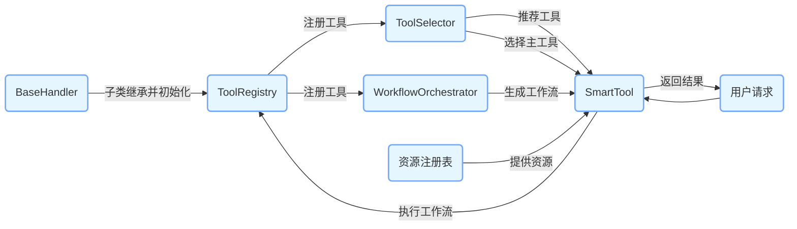
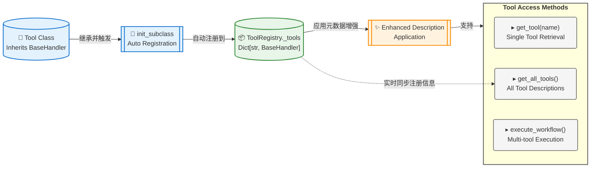
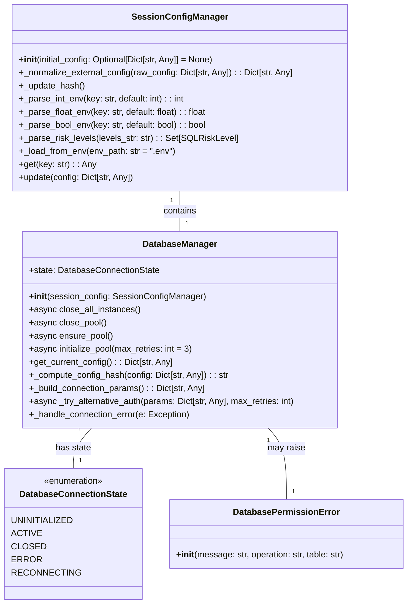
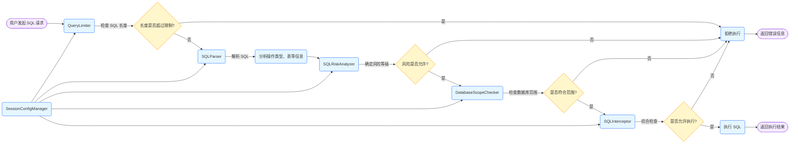

提问：深度分析仓库源码逻辑，帮我生成一份精美的完整的整体架构设计图以及各个组件模块之间的逻辑调用图给我。

再次提问：生成的太宏观了，请再次生成一份精美的细致的整体架构图以及各个模块之间的执行流程图，以及客户端请求服务端后，服务端的执行流程和响应结果的整体流程图。


## 系统架构图

上面生成的整体架构图已经非常完美了，但还存在一些问题，如下代码是我修改后的，请你美化一下颜色和各个模块之间的排版以及模块之间箭头要双向表明请求和响应是完整的，最后可视化出来：

```Mermaid
graph LR
    classDef process fill:#E5F6FF,stroke:#73A6FF,stroke-width:2px;
    classDef subgraphFill fill:#f9f9f9,stroke:#ccc,stroke-width:2px;
    
    subgraph 用户端
        style 用户端 fill:#ffffff,stroke:#000000,stroke-width:2px,shape:rounded
        VSCode(VSCode Cline插件):::process
        Browser(浏览器):::process
    end
    
    subgraph 服务端
        style 服务端 fill:#ffffff,stroke:#000000,stroke-width:2px,shape:rounded
        
        subgraph 认证模块
            style 认证模块 fill:#e6f7ff,stroke:#91caff,stroke-width:1px,shape:rounded
            OAuth(OAuth 2.0认证):::process
        end

        subgraph SQL鉴权模块
            style SQL鉴权模块 fill:#e6f7ff,stroke:#91caff,stroke-width:1px,shape:rounded
            SQLIntercept(SQL拦截解析权限认证):::process
        end
        
        subgraph 工具模块
            style 工具模块 fill:#fff6cc,stroke:#ffbc52,stroke-width:1px,shape:rounded
            SmartTool(智能工具协调器):::process
            GetTableName(表名查找器):::process
            GetTableDesc(表结构查询器):::process
            SqlExecutor(SQL执行器):::process
            AnalyzeQuery(查询性能分析器):::process
            LogTool(SQL执行日志工具):::process
            OtherTools(其他工具):::process
        end
        
        subgraph 工作流模块
            style 工作流模块 fill:#d9f7be,stroke:#95de64,stroke-width:1px,shape:rounded
            Workflow(工作流编排器):::process
        end
        
        subgraph 提示词模块
            style 提示词模块 fill:#e9d8fd,stroke:#b37feb,stroke-width:1px,shape:rounded
            QueryTableDataPrompt(查询表数据提示词):::process
            PerformOptPrompt(性能优化提示词):::process
            IndexOptAdvisorPrompt(索引优化顾问提示词):::process
        end

        subgraph 资源模块
            style 资源模块 fill:#fff0f6,stroke:#ff85c0,stroke-width:1px,shape:rounded
            LogsResources(系统SQL执行日志资源):::process
        end
        
        Server(server_mysql):::process
    end
    
    subgraph 数据库管理器
        style 数据库管理器 fill:#ffffff,stroke:#000000,stroke-width:2px,shape:rounded
        DBManager(MySQL数据库管理器):::process
    end

    subgraph 数据库
        style 数据库 fill:#ffffff,stroke:#000000,stroke-width:2px,shape:rounded
        MySQL(MySQL数据库):::process
    end
    
    VSCode <-->|请求/响应| Server
    Browser <-->|请求/响应| Server
    Server <-->|认证请求/结果| OAuth
    Server <-->|任务分发/状态反馈| SmartTool
    Server <-->|调用请求/返回结果| GetTableName
    Server <-->|调用请求/返回结果| GetTableDesc
    Server <-->|调用请求/返回结果| SqlExecutor
    Server <-->|调用请求/返回结果| AnalyzeQuery
    Server <-->|调用请求/返回结果| LogTool
    Server <-->|调用请求/返回结果| OtherTools
    SmartTool <-->|任务编排/状态更新| Workflow
    Workflow <-->|工具调用/执行结果| GetTableName
    Workflow <-->|工具调用/执行结果| GetTableDesc
    Workflow <-->|工具调用/执行结果| SqlExecutor
    Workflow <-->|工具调用/执行结果| AnalyzeQuery
    Workflow <-->|工具调用/执行结果| LogTool
    Workflow <-->|工具调用/执行结果| OtherTools
    LogTool <-->|日志记录/日志获取| LogsResources
    LogsResources <-->|日志反馈/日志请求| Server
    GetTableName <-->|表名提供/需求确认| SqlExecutor
    GetTableDesc <-->|表结构提供/需求确认| SqlExecutor
    AnalyzeQuery <-->|性能分析提供/需求确认| SqlExecutor
    OtherTools <-->|辅助信息提供/需求确认| SqlExecutor
    SqlExecutor <-->|待鉴权SQL/鉴权结果| SQLIntercept
    SQLIntercept <-->|鉴权通过/操作结果| DBManager
    DBManager <-->|数据操作/操作结果| MySQL
    QueryTableDataPrompt -->|指导| SmartTool
    PerformOptPrompt -->|指导| SmartTool
    IndexOptAdvisorPrompt -->|指导| SmartTool
    QueryTableDataPrompt -->|指导| OtherTools
    PerformOptPrompt -->|指导| OtherTools
    IndexOptAdvisorPrompt -->|指导| OtherTools
    QueryTableDataPrompt -->|指导| SqlExecutor
    PerformOptPrompt -->|指导| SqlExecutor
    IndexOptAdvisorPrompt -->|指导| SqlExecutor
```

## 模块之间的关系图

上面生成的模块之间的关系图已经非常完美了，但还存在一些问题，如下代码是我修改后的，请你美化一下颜色和各个模块之间的排版以及模块之间箭头要双向表明请求和响应是完整的，最后可视化出来：




## 客户端请求服务端后，服务端的执行流程和响应结果的整体流程图

上面生成的客户端请求服务端后，服务端的执行流程和响应结果的整体流程图有些简单了，缺少通信机制，会话管理等逻辑流程。现在我想让你再次深入的分析仓库源码逻辑，修改如下绘图代码可视化从用户在客户端发起提问请求，到服务器端进行解析调用工具处理数据，再返回给客户端的完整流程：



## 服务启动脚本架构图




### 服务脚本生命周期图




## 整个工具框架设计图



### 工具注册逻辑图




## 数据库管理类




## SQL鉴权逻辑链路图




