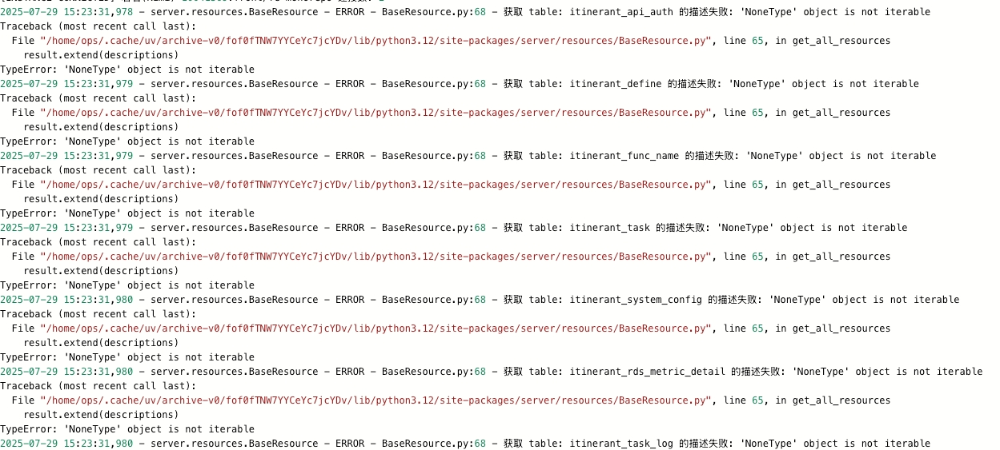
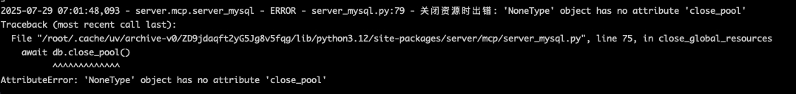

# 版本迭代记录

## V_0.7.0
### 测试发现的问题
- 数据库切换工具：
  - 切换失败没有回滚环境配置，导致虽切换失败但环境配置信息已经变更，若切换的是无效配置，会导致服务奔溃。
- 数据库健康分析工具缺少锁的分析SQL---不算bug，功能待补充
- 数据库冗余索引分析的 sql 无法做到多版本兼容---完善 sql 即可
- 数据库元数据收集工具存在问题，需要修复：测试发现主要是数据解析的问题
- 有待进一步验证数据库切换后，多用户间是否存在影响

## V_0.8.0
### 测试发现的问题
- 资源加载时的描述发生error：

  - 重新定义类的继承关系并在子类中重写get_resource_descriptions修复该问题
- 服务关闭时报资源关闭异常error：

  - 在类DatabaseManager中添加全局资源跟踪属性，记录所有资源
```python
 # 跟踪所有实例
_all_instances = weakref.WeakSet()

# 类初始化时加载所有资源：
# 添加到实例集合
DatabaseManager._all_instances.add(self)

# 然后提供类方法在服务关闭时，从全局资源关闭方法中进行调用，保证资源均正常关闭
@classmethod
    async def close_all_instances(cls):
        """关闭所有数据库管理器实例的连接池"""
        logger.info("关闭所有数据库连接池...")
        for instance in list(cls._all_instances):
            try:
                await instance.close_pool()
            except Exception as e:
                logger.error(f"关闭数据库连接池失败: {str(e)}")
```


